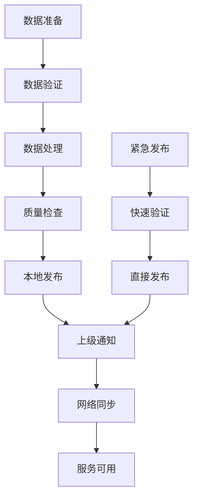
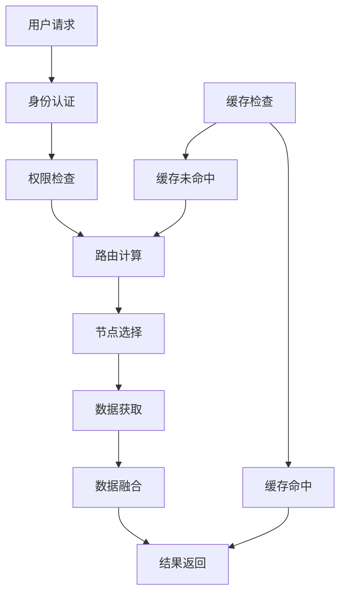
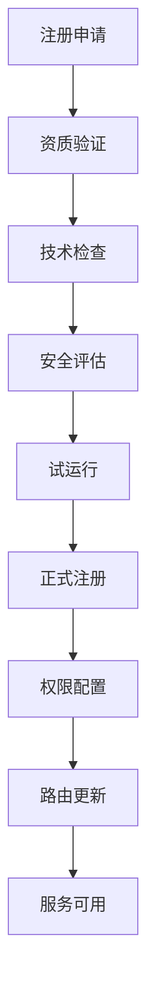

# 用户场景与角色深度解析

## 概述

S-100海事服务平台的设计基于真实海事业务场景，通过深入的用户研究和需求分析，构建了完整的用户角色体系和权限管理机制。本文档深入解析各个用户场景、角色定义、权限体系以及实际业务流程。

## 用户场景深度分析

### 1. 终端用户场景 (End User Scenario)

#### 场景描述
**代表人物**：伊娃船长 (Captain Eva)
**背景**：全球航行的商船船长，拥有20年航海经验，主要航行于亚洲-欧洲航线
**核心需求**：在任何海域都能通过单一入口获取准确、及时的海事数据

#### 详细用户故事

**故事 #1: 无缝全球漫游**
> "作为一名船长，我的船从上海驶往釜山，我希望我的ECDIS无需切换任何服务地址，就能在我离开中国海区时自动停止接收中国海图更新，进入韩国海区时自动开始接收韩国的官方海图。"

**技术实现**：
```typescript
// 全球路由服务
class GlobalRoutingService {
  async routeRequest(request: S100Request): Promise<S100Response> {
    // 1. 解析请求地理范围
    const bbox = request.getBbox()
    
    // 2. 查找覆盖该范围的节点
    const nodes = await this.findCoveringNodes(bbox)
    
    // 3. 按优先级排序节点
    const sortedNodes = this.sortNodesByPriority(nodes)
    
    // 4. 转发请求到最佳节点
    const response = await this.forwardRequest(request, sortedNodes[0])
    
    // 5. 返回处理结果
    return response
  }
  
  private async findCoveringNodes(bbox: BoundingBox): Promise<Node[]> {
    // 从全球根节点开始递归查找
    return await this.recursiveNodeSearch(bbox, this.globalRootNode)
  }
}
```

**用户体验**：
- 无需手动切换数据源
- 自动识别当前位置和对应数据服务
- 平滑的数据过渡，无感知切换

---

**故事 #2: 动态风险评估**
> "作为一名导航员，当我要穿越繁忙的马六甲海峡时，我希望在一个视图里，同时看到官方海图(S-101)、实时海流(S-111)、动态水位(S-104)和最新的航行警告(S-124)。我需要知道这些数据分别由新加坡、马来西亚和印尼提供，并且都是最新的。"

**技术实现**：
```typescript
// 多源数据融合服务
class MultiSourceDataFusionService {
  async getFusedMaritimeData(bbox: BoundingBox): Promise<FusedMaritimeData> {
    // 并行请求多个数据源
    const [s101Data, s111Data, s104Data, s124Data] = await Promise.all([
      this.requestS101Data(bbox),
      this.requestS111Data(bbox),
      this.requestS104Data(bbox),
      this.requestS124Data(bbox)
    ])
    
    // 数据融合处理
    const fusedData = this.fuseData({
      s101: s101Data,
      s111: s111Data,
      s104: s104Data,
      s124: s124Data
    })
    
    // 添加数据源信息
    fusedData.metadata = {
      s101: { provider: 'Singapore MPA', lastUpdate: s101Data.timestamp },
      s111: { provider: 'Malaysia JLS', lastUpdate: s111Data.timestamp },
      s104: { provider: 'Indonesia BSH', lastUpdate: s104Data.timestamp },
      s124: { provider: 'Singapore MPA', lastUpdate: s124Data.timestamp }
    }
    
    return fusedData
  }
}
```

**用户体验**：
- 统一的视图中显示多源数据
- 实时数据更新和状态显示
- 清晰的数据来源标识
- 数据质量评估和可信度指示

---

**故事 #3: 服务能力探索**
> "作为一名导航员，在规划前往一个我不熟悉的新港口（如巴西的桑托斯港）的航线时，我希望能在ECDIS上查询该港口到底提供了哪些先进的S-100服务（比如他们有没有S-102高精度水深？），以便我能更好地评估航行风险。"

**技术实现**：
```typescript
// 服务发现服务
class ServiceDiscoveryService {
  async discoverServices(bbox: BoundingBox): Promise<ServiceDiscoveryResult> {
    // 递归查询服务能力
    const capabilities = await this.recursiveCapabilityQuery(bbox)
    
    // 聚合和分类服务信息
    const servicesByProduct = this.groupServicesByProduct(capabilities)
    
    // 添加服务可用性评估
    const availability = await this.assessServiceAvailability(servicesByProduct)
    
    return {
      bbox,
      services: servicesByProduct,
      availability,
      lastUpdated: new Date()
    }
  }
  
  private async recursiveCapabilityQuery(bbox: BoundingBox): Promise<Capability[]> {
    // 从全球根节点开始递归查询
    const result: Capability[] = []
    
    await this.queryNodeCapabilities(this.globalRootNode, bbox, result)
    
    return result
  }
}
```

**用户体验**：
- 直观的服务能力展示界面
- 按产品类型分类的服务列表
- 服务可用性和质量指标
- 历史服务使用统计

### 2. 本地数据提供者场景 (Local Data Provider Scenario)

#### 场景描述
**代表人物**：李工 (Li Wei)
**背景**：上海港务局数据管理中心主任，负责上海港范围内所有S-100数据的发布和管理
**核心需求**：高效、自主地管理本地数据，同时与上级节点保持同步

#### 详细用户故事

**故事 #4: 发布紧急航道变更**
> "作为上海港的数据管理员，由于航道疏浚，我需要立即发布一个新的S-101海图更新包。我希望在我点击'发布'按钮后，所有通过我们上级（东海分局）乃至全球服务访问上海港区域的用户，都能在几分钟内看到新的航道。"

**技术实现**：
```typescript
// 紧急数据发布服务
class EmergencyDataPublishingService {
  async publishEmergencyUpdate(datasetId: string, updateData: EmergencyUpdate): Promise<PublishResult> {
    // 1. 验证数据完整性
    await this.validateDataIntegrity(updateData)
    
    // 2. 本地发布
    const localResult = await this.publishLocally(datasetId, updateData)
    
    // 3. 通知上级节点
    await this.notifyParentNodes({
      datasetId,
      updateType: 'emergency',
      timestamp: new Date(),
      checksum: localResult.checksum
    })
    
    // 4. 监控发布状态
    const status = await this.monitorPublishingStatus(datasetId)
    
    // 5. 通知订阅用户
    await this.notifySubscribers(datasetId, 'emergency_update')
    
    return {
      success: true,
      datasetId,
      publishTime: new Date(),
      distributionStatus: status
    }
  }
}
```

**用户体验**：
- 一键式紧急发布流程
- 实时发布状态监控
- 自动上级节点通知
- 用户订阅通知

---

**故事 #5: 试点新服务**
> "作为上海港的数据管理员，我们正在试点一个港区专用的S-131海洋保护区服务。我希望能在我们的节点上独立部署这项新服务，并让我们内部的引航员和VTS使用，而这个服务一开始不需要被上级甚至全球知道。"

**技术实现**：
```typescript
// 服务试点管理服务
class ServicePilotService {
  async createPilotService(pilotConfig: PilotServiceConfig): Promise<PilotService> {
    // 1. 创建私有服务实例
    const service = await this.createPrivateService({
      ...pilotConfig,
      visibility: 'private',
      scope: 'local'
    })
    
    // 2. 配置访问控制
    await this.configureAccessControl({
      serviceId: service.id,
      allowedUsers: pilotConfig.allowedUsers,
      allowedIPs: pilotConfig.allowedIPs
    })
    
    // 3. 启动服务监控
    await this.startServiceMonitoring(service.id)
    
    // 4. 创建使用统计
    await this.initializeUsageTracking(service.id)
    
    return service
  }
  
  async promoteToProduction(serviceId: string): Promise<void> {
    // 1. 评估试点效果
    const evaluation = await this.evaluatePilotResults(serviceId)
    
    if (evaluation.success) {
      // 2. 更新服务配置为生产状态
      await this.updateServiceVisibility(serviceId, 'public')
      
      // 3. 注册到上级节点
      await this.registerToParentNode(serviceId)
      
      // 4. 更新服务能力文档
      await this.updateServiceDocumentation(serviceId)
    }
  }
}
```

**用户体验**：
- 私有服务创建和管理
- 灵活的访问控制配置
- 试点效果评估工具
- 一键式生产环境推广

---

**故事 #6: 向网络"官宣"新服务**
> "作为上海港的数据管理员，在S-131试点成功后，我希望能通过一个简单的配置更新，将这项新服务正式'广播'给我的上级（东海分局），让他们知道我们现在能提供这项服务了。"

**技术实现**：
```typescript
// 服务注册服务
class ServiceRegistrationService {
  async registerServiceToParent(serviceId: string): Promise<RegistrationResult> {
    // 1. 获取服务信息
    const service = await this.getServiceDetails(serviceId)
    
    // 2. 准备注册数据
    const registrationData = {
      serviceId: service.id,
      serviceType: service.type,
      productType: service.productType,
      endpoint: service.endpoint,
      capabilities: service.capabilities,
      coverage: service.coverage,
      qualityMetrics: service.qualityMetrics
    }
    
    // 3. 向父节点注册
    const parentResponse = await this.registerToParentNode(registrationData)
    
    // 4. 更新本地服务状态
    await this.updateServiceStatus(serviceId, {
      registered: true,
      registrationTime: new Date(),
      parentId: parentResponse.parentNodeId
    })
    
    // 5. 启用网络访问
    await this.enableFederatedAccess(serviceId)
    
    return {
      success: true,
      serviceId,
      registrationId: parentResponse.registrationId,
      timestamp: new Date()
    }
  }
}
```

**用户体验**：
- 简单的服务注册界面
- 自动化的父节点通信
- 服务状态实时更新
- 网络访问权限管理

### 3. 区域节点管理员场景 (Regional Node Administrator Scenario)

#### 场景描述
**代表人物**：王处长 (Director Wang)
**背景**：中国海事局东海分局局长，负责协调华东沿海所有港口的数据服务和质量管理
**核心需求**：全面掌握区域内的服务状况，协调各港口节点工作

#### 详细用户故事

**故事 #7: 协调区域服务**
> "作为东海分局的管理者，我需要一个仪表盘，能让我一目了然地看到上海港、宁波港、青岛港等所有下属节点的服务健康状态和它们各自提供了哪些S-100产品。当宁波港的S-102服务挂了，我需要立刻收到警报。"

**技术实现**：
```typescript
// 区域监控仪表板服务
class RegionalMonitoringDashboardService {
  async getRegionalDashboard(): Promise<RegionalDashboard> {
    // 1. 获取所有子节点状态
    const childNodes = await this.getChildNodes()
    
    // 2. 并行检查各节点健康状态
    const healthStatuses = await Promise.all(
      childNodes.map(node => this.checkNodeHealth(node.id))
    )
    
    // 3. 获取各节点服务能力
    const capabilities = await Promise.all(
      childNodes.map(node => this.getNodeCapabilities(node.id))
    )
    
    // 4. 分析服务健康状态
    const serviceHealth = this.analyzeServiceHealth(healthStatuses, capabilities)
    
    // 5. 生成告警信息
    const alerts = this.generateAlerts(serviceHealth)
    
    return {
      region: 'East China Sea',
      timestamp: new Date(),
      nodes: childNodes.map((node, index) => ({
        ...node,
        health: healthStatuses[index],
        capabilities: capabilities[index]
      })),
      serviceHealth,
      alerts
    }
  }
  
  private async checkNodeHealth(nodeId: string): Promise<NodeHealthStatus> {
    // 检查节点响应时间
    const responseTime = await this.measureResponseTime(nodeId)
    
    // 检查服务可用性
    const serviceAvailability = await this.checkServiceAvailability(nodeId)
    
    // 检查数据新鲜度
    const dataFreshness = await this.checkDataFreshness(nodeId)
    
    return {
      nodeId,
      responseTime,
      serviceAvailability,
      dataFreshness,
      overallHealth: this.calculateOverallHealth(responseTime, serviceAvailability, dataFreshness)
    }
  }
}
```

**用户体验**：
- 实时区域监控仪表板
- 节点健康状态可视化
- 服务能力统一展示
- 智能告警和通知

---

**故事 #8: 接入新的港口节点**
> "作为东海分局的管理者，当连云港新建了他们自己的S-100服务节点后，我需要能很方便地将连云港节点'注册'到我的东海分局服务网络中。注册成功后，所有访问东海区域的请求就应该能自动路由到连云港了。"

**技术实现**：
```typescript
// 节点注册服务
class NodeRegistrationService {
  async registerChildNode(registrationData: ChildNodeRegistration): Promise<RegistrationResult> {
    // 1. 验证节点信息
    await this.validateNodeInfo(registrationData)
    
    // 2. 测试节点连通性
    const connectivity = await this.testNodeConnectivity(registrationData.apiUrl)
    
    // 3. 验证节点能力
    const capabilities = await this.validateNodeCapabilities(registrationData.apiUrl)
    
    // 4. 创建节点记录
    const node = await this.createNodeRecord({
      ...registrationData,
      connectivity,
      capabilities
    })
    
    // 5. 建立父子关系
    await this.establishParentChildRelationship(node.id)
    
    // 6. 更新路由配置
    await this.updateRoutingConfiguration(node.id)
    
    // 7. 通知相关系统
    await this.notifySystemsAboutNewNode(node.id)
    
    return {
      success: true,
      nodeId: node.id,
      registrationTime: new Date(),
      capabilities: capabilities
    }
  }
}
```

**用户体验**：
- 向导式节点注册流程
- 自动化节点验证和测试
- 实时注册状态反馈
- 自动路由配置更新

---

**故事 #9: 查看聚合能力**
> "作为东海分局的管理者，当我的上级（国家海事局）问我'你们整个东海海区现在能提供哪些服务？覆盖范围多大？'时，我希望我能立即提供一个准确的、聚合了所有下属港口能力的报告。"

**技术实现**：
```typescript
// 聚合能力查询服务
class AggregatedCapabilitiesService {
  async getAggregatedCapabilities(): Promise<AggregatedCapabilities> {
    // 1. 获取所有子节点
    const childNodes = await this.getChildNodes()
    
    // 2. 并行查询各节点能力
    const capabilitiesList = await Promise.all(
      childNodes.map(node => this.getNodeCapabilities(node.id))
    )
    
    // 3. 聚合服务能力
    const aggregatedServices = this.aggregateCapabilities(capabilitiesList)
    
    // 4. 计算覆盖范围
    const coverage = this.calculateCoverage(childNodes)
    
    // 5. 生成统计报告
    const statistics = this.generateStatistics(aggregatedServices)
    
    // 6. 评估服务质量
    const qualityMetrics = await this.assessQualityMetrics(childNodes)
    
    return {
      region: 'East China Sea',
      timestamp: new Date(),
      services: aggregatedServices,
      coverage,
      statistics,
      qualityMetrics
    }
  }
  
  private aggregateCapabilities(capabilitiesList: NodeCapability[][]): AggregatedService[] {
    const serviceMap = new Map<string, AggregatedService>()
    
    capabilitiesList.forEach(capabilities => {
      capabilities.forEach(capability => {
        const key = `${capability.productType}-${capability.serviceType}`
        
        if (!serviceMap.has(key)) {
          serviceMap.set(key, {
            productType: capability.productType,
            serviceType: capability.serviceType,
            nodes: [],
            totalCoverage: null,
            averageQuality: 0
          })
        }
        
        const service = serviceMap.get(key)!
        service.nodes.push(capability.nodeId)
      })
    })
    
    return Array.from(serviceMap.values())
  }
}
```

**用户体验**：
- 实时聚合能力查询
- 可视化覆盖范围展示
- 详细的服务统计报告
- 质量指标评估

### 4. 国家级节点管理员场景 (National Node Administrator Scenario)

#### 场景描述
**代表人物**：张总工 (Chief Engineer Zhang)
**背景**：中国海事局总工程师，负责整个中国海区的S-100服务网络建设和管理
**核心需求**：国家级服务治理，国际数据交换，全国服务协调

#### 详细用户故事

**故事 #10: 国家级服务治理**
> "作为中国海事局的技术负责人，我需要将东海、南海、北海三大分局的服务节点作为一级子节点注册到国家平台。我需要确保我的国家级平台能正确地将请求路由到对应的海区，并能向全球平台准确报告整个中国海区的服务能力。"

**技术实现**：
```typescript
// 国家级服务治理服务
class NationalServiceGovernanceService {
  async setupNationalFederation(config: NationalFederationConfig): Promise<SetupResult> {
    // 1. 验证区域节点
    const validatedNodes = await this.validateRegionalNodes(config.regionalNodes)
    
    // 2. 建立网络关系
    const federation = await this.establishFederation(validatedNodes)
    
    // 3. 配置路由策略
    await this.configureRoutingStrategies(federation)
    
    // 4. 设置数据同步机制
    await this.setupDataSynchronization(federation)
    
    // 5. 配置监控和告警
    await this.setupMonitoring(federation)
    
    // 6. 向全球根节点注册
    await this.registerToGlobalRoot(federation)
    
    return {
      success: true,
      federationId: federation.id,
      regionalNodes: validatedNodes.length,
      setupTime: new Date()
    }
  }
  
  async routeNationalRequest(request: NationalRequest): Promise<NationalResponse> {
    // 1. 解析请求区域
    const region = this.analyzeRequestRegion(request)
    
    // 2. 查找对应区域节点
    const regionalNode = await this.findRegionalNode(region)
    
    // 3. 转发请求
    const response = await this.forwardToRegionalNode(regionalNode, request)
    
    // 4. 记录路由日志
    await this.logRouting(request, response, regionalNode)
    
    // 5. 返回响应
    return response
  }
}
```

**用户体验**：
- 国家级网络配置界面
- 自动化节点验证和连接
- 智能路由策略管理
- 实时监控和告警

### 5. 全球根节点管理员场景 (Global Root Administrator Scenario)

#### 场景描述
**代表人物**：史密斯博士 (Dr. David Smith)
**背景**：国际海道测量组织(IHO)协调员，负责维护全球S-100服务网络
**核心需求**：全球网络治理，成员国关系管理，国际标准协调

#### 详细用户故事

**故事 #11: 接纳新成员国**
> "作为IHO的协调员，当阿根廷完成了他们国家级S-100节点的建设并符合我们的网络API标准后，我需要能通过一个安全的流程，将阿根廷的国家节点注册到全球根节点中。从此，全球用户就能访问到阿根廷的官方海事数据了。"

**技术实现**：
```typescript
// 成员国管理服务
class MemberCountryManagementService {
  async onboardNewCountry(countryData: NewCountryOnboarding): Promise<OnboardingResult> {
    // 1. 验证国家资质
    const qualification = await this.validateCountryQualification(countryData)
    
    // 2. 技术标准符合性检查
    const compliance = await this.checkTechnicalCompliance(countryData.nodeUrl)
    
    // 3. 安全评估
    const security = await this.conductSecurityAssessment(countryData.nodeUrl)
    
    // 4. 试运行测试
    const trial = await this.runTrialPeriod(countryData)
    
    if (qualification.valid && compliance.passed && security.approved && trial.success) {
      // 5. 正式注册
      const registration = await this.registerCountry(countryData)
      
      // 6. 配置访问权限
      await this.configureAccessRights(registration.countryId)
      
      // 7. 更新全球路由表
      await this.updateGlobalRouting(registration)
      
      // 8. 通知成员国
      await this.notifyMemberCountries(registration)
      
      return {
        success: true,
        countryId: registration.countryId,
        registrationDate: new Date()
      }
    }
    
    throw new Error('Country onboarding failed qualification checks')
  }
}
```

**用户体验**：
- 标准化的成员国接入流程
- 自动化的技术符合性检查
- 安全评估和试运行测试
- 一键式全球服务注册

---

**故事 #12: 全球网络监控**
> "作为IHO的协调员，我需要一个全球视图，让我能看到所有成员国节点的在线状态和核心服务（如S-101）的可用性。当某个国家节点出现长时间离线时，我需要能联系他们进行处理。"

**技术实现**：
```typescript
// 全球网络监控服务
class GlobalNetworkMonitoringService {
  async getGlobalNetworkStatus(): Promise<GlobalNetworkStatus> {
    // 1. 获取所有成员国节点
    const memberCountries = await this.getMemberCountries()
    
    // 2. 并行检查各节点状态
    const nodeStatuses = await Promise.all(
      memberCountries.map(country => this.checkCountryNode(country.nodeId))
    )
    
    // 3. 分析全球服务可用性
    const serviceAvailability = await this.analyzeGlobalServiceAvailability(nodeStatuses)
    
    // 4. 生成健康报告
    const healthReport = this.generateHealthReport(nodeStatuses, serviceAvailability)
    
    // 5. 识别问题节点
    const problematicNodes = this.identifyProblematicNodes(nodeStatuses)
    
    // 6. 生成建议措施
    const recommendations = this.generateRecommendations(problematicNodes)
    
    return {
      timestamp: new Date(),
      totalCountries: memberCountries.length,
      nodeStatuses,
      serviceAvailability,
      healthReport,
      problematicNodes,
      recommendations
    }
  }
  
  private async checkCountryNode(nodeId: string): Promise<CountryNodeStatus> {
    // 检查节点连通性
    const connectivity = await this.checkConnectivity(nodeId)
    
    // 检查核心服务
    const coreServices = await this.checkCoreServices(nodeId)
    
    // 检查数据质量
    const dataQuality = await this.assessDataQuality(nodeId)
    
    // 检查性能指标
    const performance = await this.measurePerformance(nodeId)
    
    return {
      nodeId,
      connectivity,
      coreServices,
      dataQuality,
      performance,
      overallHealth: this.calculateOverallHealth(connectivity, coreServices, dataQuality, performance)
    }
  }
}
```

**用户体验**：
- 全球网络状态可视化
- 实时服务监控仪表板
- 智能问题识别和告警
- 自动化建议和措施

## 权限体系深度解析

### 角色权限矩阵

| 权限类别 | 具体权限 | ADMIN | NODE_ADMIN | DATA_MANAGER | SERVICE_MANAGER | USER | GUEST |
|---------|---------|-------|------------|--------------|-----------------|------|-------|
| **节点管理** | NODE_CREATE | ✅ | ✅ | ❌ | ❌ | ❌ | ❌ |
| | NODE_READ | ✅ | ✅ | ✅ | ✅ | ✅ | ✅ |
| | NODE_UPDATE | ✅ | ✅ | ❌ | ❌ | ❌ | ❌ |
| | NODE_DELETE | ✅ | ❌ | ❌ | ❌ | ❌ | ❌ |
| **数据管理** | DATASET_CREATE | ✅ | ✅ | ✅ | ❌ | ❌ | ❌ |
| | DATASET_READ | ✅ | ✅ | ✅ | ✅ | ✅ | ✅ |
| | DATASET_UPDATE | ✅ | ✅ | ✅ | ❌ | ❌ | ❌ |
| | DATASET_DELETE | ✅ | ❌ | ✅ | ❌ | ❌ | ❌ |
| | DATASET_PUBLISH | ✅ | ✅ | ✅ | ❌ | ❌ | ❌ |
| **服务管理** | SERVICE_CREATE | ✅ | ✅ | ❌ | ✅ | ❌ | ❌ |
| | SERVICE_READ | ✅ | ✅ | ✅ | ✅ | ✅ | ✅ |
| | SERVICE_UPDATE | ✅ | ✅ | ❌ | ✅ | ❌ | ❌ |
| | SERVICE_DELETE | ✅ | ❌ | ❌ | ✅ | ❌ | ❌ |
| **用户管理** | USER_CREATE | ✅ | ✅ | ❌ | ❌ | ❌ | ❌ |
| | USER_READ | ✅ | ✅ | ❌ | ❌ | ❌ | ❌ |
| | USER_UPDATE | ✅ | ✅ | ❌ | ❌ | ❌ | ❌ |
| | USER_DELETE | ✅ | ❌ | ❌ | ❌ | ❌ | ❌ |
| **系统管理** | SYSTEM_CONFIG | ✅ | ❌ | ❌ | ❌ | ❌ | ❌ |
| | SYSTEM_MONITOR | ✅ | ✅ | ✅ | ✅ | ❌ | ❌ |

### 场景化权限配置

#### 终端用户场景权限
```typescript
const endUserPermissions = {
  // 基础数据访问
  canReadNodes: true,
  canReadDatasets: true,
  canReadServices: true,
  
  // 地图服务使用
  canUseMapServices: true,
  canViewLayers: true,
  canExportData: true,
  
  // 个人设置
  canManageProfile: true,
  canSavePreferences: true,
  
  // 限制权限
  cannotCreateData: true,
  cannotUpdateData: true,
  cannotDeleteData: true,
  cannotManageUsers: true,
  cannotConfigureSystem: true
}
```

#### 数据管理员场景权限
```typescript
const dataManagerPermissions = {
  // 节点查看
  canReadNodes: true,
  
  // 数据管理
  canCreateDatasets: true,
  canReadDatasets: true,
  canUpdateDatasets: true,
  canDeleteDatasets: true,
  canPublishDatasets: true,
  
  // 服务查看
  canReadServices: true,
  
  // 系统监控
  canMonitorSystem: true,
  
  // 限制权限
  cannotManageNodes: true,
  cannotCreateServices: true,
  cannotManageUsers: true,
  cannotConfigureSystem: true
}
```

#### 区域管理员场景权限
```typescript
const regionalAdminPermissions = {
  // 节点管理
  canCreateNodes: true,
  canReadNodes: true,
  canUpdateNodes: true,
  
  // 数据管理
  canCreateDatasets: true,
  canReadDatasets: true,
  canUpdateDatasets: true,
  canPublishDatasets: true,
  
  // 服务管理
  canCreateServices: true,
  canReadServices: true,
  canUpdateServices: true,
  
  // 用户管理
  canCreateUsers: true,
  canReadUsers: true,
  canUpdateUsers: true,
  
  // 系统监控
  canMonitorSystem: true,
  
  // 限制权限
  cannotDeleteNodes: true,
  cannotDeleteDatasets: true,
  cannotDeleteServices: true,
  cannotDeleteUsers: true,
  cannotConfigureSystem: true
}
```

### 动态权限计算

```typescript
class DynamicPermissionService {
  async calculateUserPermissions(userId: string): Promise<CalculatedPermissions> {
    // 1. 获取用户基本信息
    const user = await this.getUserById(userId)
    
    // 2. 获取角色基础权限
    const rolePermissions = await this.getRolePermissions(user.role)
    
    // 3. 获取用户特定权限
    const userPermissions = await this.getUserSpecificPermissions(userId)
    
    // 4. 获取场景权限
    const scenarioPermissions = await this.getScenarioPermissions(user.scenario)
    
    // 5. 获取节点权限（如果有）
    const nodePermissions = user.nodeId 
      ? await this.getNodePermissions(user.nodeId)
      : {}
    
    // 6. 计算最终权限
    const finalPermissions = this.mergePermissions({
      role: rolePermissions,
      user: userPermissions,
      scenario: scenarioPermissions,
      node: nodePermissions
    })
    
    // 7. 应用时间/位置等动态限制
    const restrictedPermissions = this.applyDynamicRestrictions(
      finalPermissions,
      user
    )
    
    return restrictedPermissions
  }
  
  private mergePermissions(permissions: PermissionSources): PermissionSet {
    // 权限合并逻辑，考虑优先级和冲突解决
    // 用户权限 > 场景权限 > 节点权限 > 角色权限
    return this.resolvePermissionConflicts(permissions)
  }
  
  private applyDynamicRestrictions(
    permissions: PermissionSet,
    user: User
  ): PermissionSet {
    // 应用时间限制
    if (this.isBusinessHours()) {
      permissions = this.restrictBusinessHours(permissions)
    }
    
    // 应用位置限制
    if (user.location) {
      permissions = this.restrictByLocation(permissions, user.location)
    }
    
    // 应用系统状态限制
    if (this.isSystemMaintenance()) {
      permissions = this.restrictDuringMaintenance(permissions)
    }
    
    return permissions
  }
}
```

## 实际业务流程

### 1. 数据发布流程



### 2. 用户访问流程



### 3. 节点注册流程



## 总结

S-100海事服务平台通过深入的用户场景分析和角色设计，构建了一个完整的、可扩展的海事数据服务生态系统。每个用户场景都基于真实的业务需求，通过技术实现提供了优秀的用户体验。权限体系的设计既保证了安全性，又提供了足够的灵活性，支持复杂的网络架构和多层次的管理需求。

系统的核心优势在于：

1. **场景化设计**：基于真实业务场景，提供精准的功能支持
2. **网络架构**：支持全球范围的数据服务网络，实现无缝访问
3. **权限灵活**：多层次、动态的权限管理，适应各种业务需求
4. **技术先进**：采用现代化的技术栈，确保系统的可扩展性和维护性
5. **用户体验**：直观的界面设计，简化复杂的操作流程

通过这种深入的场景分析和角色设计，系统能够更好地服务于海事行业的各个层面，从终端用户到全球管理员，提供完整的数据服务解决方案。