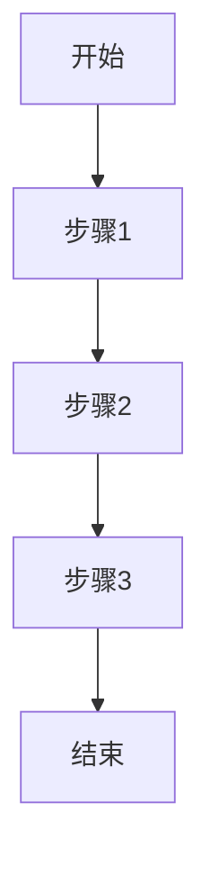
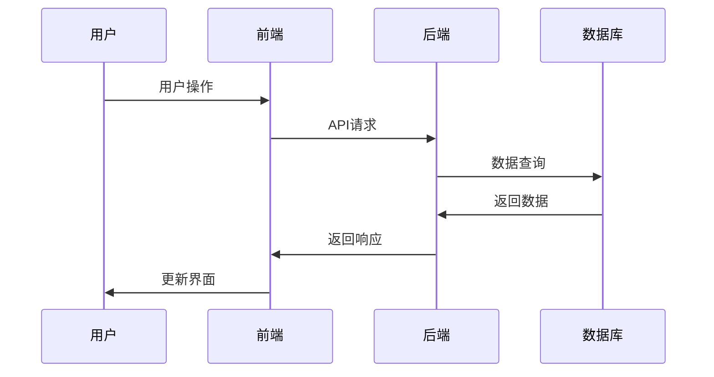

# S-100 WebGIS 文档规范

## 概述

本文档定义了S-100 WebGIS项目的文档编写规范，确保文档的一致性、完整性和可维护性。项目采用中英文双语文档策略，技术文档以英文为主，业务文档以中文为主。

## 1. 文档分类和结构

### 1.1 项目文档目录结构
```
docs/
├── README.md                           # 文档导航和概述
├── CODING_STANDARDS.md                 # 编码规范
├── DOCUMENTATION_STANDARDS.md          # 文档规范 (本文档)
├── ARCHITECTURE.md                     # 系统架构
├── CODE_EXAMPLES.md                    # 代码示例
├── API/
│   ├── README.md                       # API文档概述
│   ├── REST_API.md                     # REST API文档
│   └── WEBSOCKET_API.md                # WebSocket API文档
├── GUIDES/
│   ├── README.md                       # 开发指南概述
│   ├── GETTING_STARTED.md              # 快速开始
│   ├── DEVELOPMENT.md                  # 开发环境搭建
│   └── DEPLOYMENT.md                   # 部署指南
├── COMPONENTS/
│   ├── README.md                       # 组件文档概述
│   ├── MAP_COMPONENTS.md               # 地图组件文档
│   └── UI_COMPONENTS.md                # UI组件文档
├── FEATURES/
│   ├── README.md                       # 功能文档概述
│   ├── MAP_SERVICES.md                 # 地图服务功能
│   └── NODE_MANAGEMENT.md              # 节点管理功能
├── DATABASE/
│   ├── README.md                       # 数据库文档概述
│   ├── SCHEMA.md                       # 数据库模式
│   └── USAGE.md                        # 数据库使用指南
├── DEVELOPMENT/
│   ├── README.md                       # 开发文档概述
│   ├── TASK_MANAGEMENT_GUIDE.md       # 任务管理指南
│   └── tasks/                          # 任务相关文档
│       ├── templates/                  # 任务模板
│       └── completed/                  # 已完成任务
├── PROJECT_SUMMARY/
│   ├── README.md                       # 项目总结概述
│   └── [各种报告文件]                  # 项目状态报告
└── TOOLS/
    └── README.md                       # 工具文档概述
```

### 1.2 代码内文档结构
```
src/
├── components/
│   ├── ComponentName/
│   │   ├── index.tsx                   # 组件导出文件
│   │   ├── ComponentName.tsx           # 组件实现
│   │   ├── ComponentName.types.ts      # 组件类型定义
│   │   ├── ComponentName.test.tsx      # 组件测试
│   │   └── README.md                   # 组件文档
├── lib/
│   ├── services/
│   │   ├── serviceName.ts              # 服务实现
│   │   ├── serviceName.types.ts       # 服务类型定义
│   │   ├── serviceName.test.ts        # 服务测试
│   │   └── README.md                   # 服务文档
│   └── utils/
│       ├── utilName.ts                 # 工具函数
│       ├── utilName.test.ts           # 工具测试
│       └── README.md                   # 工具文档
├── hooks/
│   ├── useHookName.ts                  # Hook实现
│   ├── useHookName.test.ts            # Hook测试
│   └── README.md                       # Hook文档
└── app/
    └── api/
        └── [route]/
            ├── route.ts                 # API路由
            ├── route.test.ts            # API测试
            └── README.md                 # API文档
```

## 2. 文档格式规范

### 2.1 Markdown文档格式

#### 文档头部元数据
```markdown
---
title: 文档标题
description: 文档描述
author: 作者姓名
date: 2024-01-01
version: 1.0.0
category: 文档分类
tags: [标签1, 标签2]
language: zh-CN # 或 en-US
---

# 文档标题

## 概述

本文档描述了...
```

#### 标题层级规范
```markdown
# 一级标题 (文档标题)
## 二级标题 (主要章节)
### 三级标题 (子章节)
#### 四级标题 (小节)
##### 五级标题 (子小节)
###### 六级标题 (段落标题)
```

#### 代码块格式
```markdown
```typescript
// TypeScript代码
const example: string = "Hello World";
```

```javascript
// JavaScript代码
const example = "Hello World";
```

```bash
# 命令行
npm install
```

```json
// JSON配置
{
  "key": "value"
}
```

```sql
-- SQL查询
SELECT * FROM users WHERE id = 1;
```
```

#### 表格格式
```markdown
| 参数名 | 类型 | 必需 | 描述 | 默认值 |
|--------|------|------|------|--------|
| id | string | 是 | 用户ID | - |
| name | string | 是 | 用户名称 | - |
| email | string | 是 | 用户邮箱 | - |
| isActive | boolean | 否 | 是否激活 | true |
```

#### 链接和引用
```markdown
[链接文本](链接地址)

[内部链接](../GUIDES/GETTING_STARTED.md)

[外部链接](https://example.com)

[引用链接][reference-link]

[reference-link]: https://example.com
```

#### 图片格式
```markdown


```

#### 提示和警告
```markdown
> **注意**: 这是一个重要提示

> **警告**: 这是一个警告信息

> **危险**: 这是一个危险操作提示

> **提示**: 这是一个有用的提示
```

#### 列表格式
```markdown
无序列表：
- 项目1
- 项目2
  - 子项目1
  - 子项目2
- 项目3

有序列表：
1. 第一步
2. 第二步
   1. 子步骤1
   2. 子步骤2
3. 第三步

任务列表：
- [x] 已完成任务
- [ ] 未完成任务
```

### 2.2 JSDoc注释规范

#### 文件注释
```typescript
/**
 * @fileoverview 用户服务模块
 * 提供用户相关的业务逻辑和数据操作
 * @author 开发者姓名
 * @since 2024-01-01
 * @version 1.0.0
 * @module services/userService
 */
```

#### 类注释
```typescript
/**
 * 用户服务类
 * 提供用户管理的核心功能
 * @class UserService
 */
export class UserService {
  /**
   * 创建用户服务实例
   * @param {ApiClient} apiClient - API客户端
   */
  constructor(apiClient: ApiClient) {
    this.apiClient = apiClient;
  }
}
```

#### 函数注释
```typescript
/**
 * 获取用户信息
 * @param {string} userId - 用户ID
 * @returns {Promise<User>} 用户信息对象
 * @throws {Error} 当用户不存在时抛出错误
 * @example
 * ```typescript
 * const user = await userService.getUser('123');
 * console.log(user.name);
 * ```
 */
export const getUser = async (userId: string): Promise<User> => {
  // 实现
};
```

#### 接口注释
```typescript
/**
 * 用户接口定义
 * @interface User
 */
export interface User {
  /** 用户ID */
  id: string;
  /** 用户名称 */
  name: string;
  /** 用户邮箱 */
  email: string;
  /** 是否激活 */
  isActive: boolean;
  /** 创建时间 */
  createdAt: Date;
  /** 更新时间 */
  updatedAt: Date;
}
```

#### 枚举注释
```typescript
/**
 * 用户状态枚举
 * @enum {string}
 */
export enum UserStatus {
  /** 激活状态 */
  ACTIVE = 'active',
  /** 未激活状态 */
  INACTIVE = 'inactive',
  /** 待审核状态 */
  PENDING = 'pending'
}
```

### 2.3 React组件文档规范

#### 组件JSDoc
```typescript
/**
 * 用户资料组件
 * 显示用户基本信息和操作按钮
 * @component UserProfile
 * @example
 * ```tsx
 * <UserProfile 
 *   user={user} 
 *   onEdit={handleEdit} 
 *   onDelete={handleDelete} 
 * />
 * ```
 */
interface UserProfileProps {
  /** 用户信息对象 */
  user: User;
  /** 编辑回调函数 */
  onEdit?: (user: User) => void;
  /** 删除回调函数 */
  onDelete?: (userId: string) => void;
  /** 是否显示操作按钮 */
  showActions?: boolean;
}

export const UserProfile: React.FC<UserProfileProps> = ({
  user,
  onEdit,
  onDelete,
  showActions = true
}) => {
  // 组件实现
};
```

#### 组件README模板
```markdown
# UserProfile Component

## 概述

用户资料组件用于显示用户的基本信息和提供相关操作。

## 使用示例

### 基本使用
```tsx
import { UserProfile } from '@/components/UserProfile';

<UserProfile user={user} />
```

### 完整使用
```tsx
<UserProfile 
  user={user}
  onEdit={handleEdit}
  onDelete={handleDelete}
  showActions={true}
/>
```

## 属性

| 属性名 | 类型 | 必需 | 默认值 | 描述 |
|--------|------|------|--------|------|
| user | User | 是 | - | 用户信息对象 |
| onEdit | (user: User) => void | 否 | - | 编辑回调函数 |
| onDelete | (userId: string) => void | 否 | - | 删除回调函数 |
| showActions | boolean | 否 | true | 是否显示操作按钮 |

## 样式

组件使用以下CSS类名：
- `user-profile`: 主容器
- `user-profile__header`: 头部区域
- `user-profile__content`: 内容区域
- `user-profile__actions`: 操作按钮区域

## 无障碍性

- 使用适当的ARIA属性
- 支持键盘导航
- 提供屏幕阅读器支持

## 相关组件

- [UserList](../UserList/README.md)
- [UserForm](../UserForm/README.md)
```

### 2.4 API文档规范

#### REST API文档模板
```markdown
## 获取用户信息

### 请求
- **方法**: `GET`
- **路径**: `/api/users/{id}`
- **认证**: Bearer Token
- **内容类型**: `application/json`

### 路径参数
| 参数名 | 类型 | 必需 | 描述 |
|--------|------|------|------|
| id | string | 是 | 用户ID |

### 查询参数
| 参数名 | 类型 | 必需 | 默认值 | 描述 |
|--------|------|------|--------|------|
| include | string | 否 | - | 包含的字段 |

### 请求示例
```bash
curl -X GET "http://localhost:3000/api/users/123?include=profile" \
  -H "Authorization: Bearer token" \
  -H "Content-Type: application/json"
```

### 响应

#### 成功响应 (200 OK)
```json
{
  "success": true,
  "data": {
    "id": "123",
    "name": "John Doe",
    "email": "john@example.com",
    "isActive": true,
    "createdAt": "2024-01-01T00:00:00Z",
    "updatedAt": "2024-01-01T00:00:00Z"
  }
}
```

#### 错误响应
```json
{
  "success": false,
  "error": {
    "code": "USER_NOT_FOUND",
    "message": "用户不存在"
  }
}
```

### 状态码
| 状态码 | 描述 |
|--------|------|
| 200 | 成功 |
| 400 | 请求参数错误 |
| 401 | 未授权 |
| 404 | 用户不存在 |
| 500 | 服务器内部错误 |
```

### 2.5 数据库文档规范

#### 表结构文档
```markdown
## users 表

### 表描述
存储用户基本信息和账户状态。

### 字段定义
| 字段名 | 类型 | 约束 | 默认值 | 描述 |
|--------|------|------|--------|------|
| id | VARCHAR(36) | PRIMARY KEY | - | 用户ID |
| name | VARCHAR(255) | NOT NULL | - | 用户名称 |
| email | VARCHAR(255) | NOT NULL, UNIQUE | - | 用户邮箱 |
| password_hash | VARCHAR(255) | NOT NULL | - | 密码哈希 |
| is_active | BOOLEAN | NOT NULL | true | 是否激活 |
| created_at | TIMESTAMP | NOT NULL | CURRENT_TIMESTAMP | 创建时间 |
| updated_at | TIMESTAMP | NOT NULL | CURRENT_TIMESTAMP | 更新时间 |

### 索引
| 索引名 | 字段 | 类型 | 描述 |
|--------|------|------|------|
| idx_users_email | email | UNIQUE | 邮箱唯一索引 |
| idx_users_active | is_active | NORMAL | 活跃状态索引 |

### 外键约束
| 外键名 | 字段 | 引用表 | 引用字段 | 删除规则 |
|--------|------|--------|----------|----------|
| fk_users_role_id | role_id | roles | id | CASCADE |

### 触发器
| 触发器名 | 时机 | 事件 | 描述 |
|----------|------|------|------|
| trg_users_updated_at | BEFORE | UPDATE | 自动更新updated_at字段 |
```

## 3. 语言规范

### 3.1 语言选择原则
- **技术文档**: 使用英文，确保国际开发者可理解
- **业务文档**: 使用中文，确保业务人员可理解
- **代码注释**: 使用英文，遵循行业标准
- **用户界面**: 使用中文，面向最终用户

### 3.2 术语一致性
- **统一术语**: 在整个文档中使用一致的术语
- **中英文对照**: 重要术语提供中英文对照
- **缩写定义**: 首次出现时定义缩写

### 3.3 文档语言标识
```markdown
---
language: zh-CN # 或 en-US
---
```

## 4. 文档维护规范

### 4.1 文档更新流程
1. **开发阶段**: 在开发功能时同步编写文档
2. **代码审查**: 将文档更新作为代码审查的一部分
3. **发布前**: 确保文档与代码保持一致
4. **发布后**: 更新相关文档和版本信息

### 4.2 文档审查清单
- [ ] 文档内容准确完整
- [ ] 代码示例可运行
- [ ] 链接和引用有效
- [ ] 格式符合规范
- [ ] 术语使用一致
- [ ] 语言表达清晰

### 4.3 版本控制
```markdown
## 版本历史

### v1.0.0 (2024-01-01)
- 初始版本发布
- 实现基本功能文档

### v1.1.0 (2024-01-15)
- 添加新功能文档
- 更新API文档
- 修复文档错误
```

## 5. 自动化工具

### 5.1 文档生成脚本
```bash
# 生成API文档
npm run docs:generate-api

# 生成组件文档
npm run docs:generate-components

# 生成类型文档
npm run docs:generate-types

# 检查文档链接
npm run docs:check-links

# 文档格式检查
npm run docs:lint
```

### 5.2 CI/CD集成
文档构建和部署应集成到CI/CD流程中，确保文档与代码同步更新。

## 6. 最佳实践

### 6.1 文档编写原则
- **清晰性**: 使用简洁明了的语言
- **完整性**: 覆盖所有重要功能
- **一致性**: 使用统一的格式和风格
- **及时性**: 代码变更时及时更新文档
- **可访问性**: 确保文档易于搜索和访问

### 6.2 文档结构原则
- **层次清晰**: 逻辑结构清晰，便于导航
- **重点突出**: 重要信息突出显示
- **示例丰富**: 提供充分的使用示例
- **索引完善**: 提供完整的索引和搜索功能

遵循这些规范将确保文档质量、一致性和可维护性。

### 2.1 Markdown格式

#### 文档头部
```markdown
---
title: 文档标题
description: 文档描述
author: 作者姓名
date: 2024-01-01
version: 1.0.0
category: 文档分类
tags: [标签1, 标签2]
---

# 文档标题

## 概述

本文档描述了...
```

#### 标题层级
```markdown
# 一级标题 (文档标题)
## 二级标题 (主要章节)
### 三级标题 (子章节)
#### 四级标题 (小节)
##### 五级标题 (子小节)
###### 六级标题 (段落标题)
```

#### 代码块
```markdown
```typescript
// TypeScript代码
const example: string = "Hello World";
```

```javascript
// JavaScript代码
const example = "Hello World";
```

```bash
# 命令行
npm install
```

```json
// JSON配置
{
  "key": "value"
}
```
```

#### 表格
```markdown
| 参数名 | 类型 | 必需 | 描述 | 默认值 |
|--------|------|------|------|--------|
| id | string | 是 | 用户ID | - |
| name | string | 是 | 用户名称 | - |
| email | string | 是 | 用户邮箱 | - |
| isActive | boolean | 否 | 是否激活 | true |
```

#### 链接和引用
```markdown
[链接文本](链接地址)

[内部链接](../GUIDES/GETTING_STARTED.md)

[外部链接](https://example.com)

[引用链接][reference-link]

[reference-link]: https://example.com
```

#### 图片
```markdown


```

#### 警告和提示
```markdown
> **注意**: 这是一个重要提示

> **警告**: 这是一个警告信息

> **危险**: 这是一个危险操作提示

> **提示**: 这是一个有用的提示
```

#### 列表
```markdown
无序列表：
- 项目1
- 项目2
  - 子项目1
  - 子项目2
- 项目3

有序列表：
1. 第一步
2. 第二步
   1. 子步骤1
   2. 子步骤2
3. 第三步

任务列表：
- [x] 已完成任务
- [ ] 未完成任务
```

### 2.2 JSDoc注释规范

#### 文件注释
```typescript
/**
 * @fileoverview 用户服务模块
 * 提供用户相关的业务逻辑和数据操作
 * @author 开发者姓名
 * @since 2024-01-01
 * @version 1.0.0
 * @module services/userService
 */
```

#### 类注释
```typescript
/**
 * 用户服务类
 * 提供用户管理的核心功能
 * @class UserService
 */
export class UserService {
  /**
   * 创建用户服务实例
   * @param {ApiClient} apiClient - API客户端
   */
  constructor(apiClient: ApiClient) {
    this.apiClient = apiClient;
  }
}
```

#### 函数注释
```typescript
/**
 * 获取用户信息
 * @param {string} userId - 用户ID
 * @returns {Promise<User>} 用户信息对象
 * @throws {Error} 当用户不存在时抛出错误
 * @example
 * ```typescript
 * const user = await userService.getUser('123');
 * console.log(user.name);
 * ```
 */
export const getUser = async (userId: string): Promise<User> => {
  // 实现
};
```

#### 接口注释
```typescript
/**
 * 用户接口定义
 * @interface User
 */
export interface User {
  /** 用户ID */
  id: string;
  /** 用户名称 */
  name: string;
  /** 用户邮箱 */
  email: string;
  /** 是否激活 */
  isActive: boolean;
  /** 创建时间 */
  createdAt: Date;
  /** 更新时间 */
  updatedAt: Date;
}
```

#### 类型注释
```typescript
/**
 * 用户状态枚举
 * @enum {string}
 */
export enum UserStatus {
  /** 激活状态 */
  ACTIVE = 'active',
  /** 未激活状态 */
  INACTIVE = 'inactive',
  /** 待审核状态 */
  PENDING = 'pending'
}
```

## 3. 文档内容规范

### 3.1 API文档规范

#### REST API文档
```markdown
## 获取用户信息

### 请求
- **方法**: `GET`
- **路径**: `/api/users/{id}`
- **认证**: Bearer Token

### 路径参数
| 参数名 | 类型 | 必需 | 描述 |
|--------|------|------|------|
| id | string | 是 | 用户ID |

### 查询参数
| 参数名 | 类型 | 必需 | 描述 | 默认值 |
|--------|------|------|------|--------|
| include | string | 否 | 包含的字段 | - |

### 请求示例
```bash
curl -X GET "http://localhost:3000/api/users/123?include=profile" \
  -H "Authorization: Bearer token" \
  -H "Content-Type: application/json"
```

### 响应
#### 成功响应 (200)
```json
{
  "success": true,
  "data": {
    "id": "123",
    "name": "John Doe",
    "email": "john@example.com",
    "isActive": true,
    "createdAt": "2024-01-01T00:00:00Z",
    "updatedAt": "2024-01-01T00:00:00Z"
  }
}
```

#### 错误响应
```json
{
  "success": false,
  "error": {
    "code": "USER_NOT_FOUND",
    "message": "用户不存在"
  }
}
```

### 状态码
| 状态码 | 描述 |
|--------|------|
| 200 | 成功 |
| 400 | 请求参数错误 |
| 401 | 未授权 |
| 404 | 用户不存在 |
| 500 | 服务器内部错误 |
```

### 3.2 组件文档规范

#### 组件文档模板
```markdown
# 组件名称

## 概述

组件描述和用途说明。

## 使用示例

### 基本使用
```tsx
import { ComponentName } from '@/components/ComponentName';

<ComponentName prop1="value1" prop2={value2}>
  子内容
</ComponentName>
```

### 高级使用
```tsx
<ComponentName
  prop1="value1"
  prop2={value2}
  onEvent={handleEvent}
>
  <ChildComponent />
</ComponentName>
```

## 属性

### 必需属性
| 属性名 | 类型 | 描述 |
|--------|------|------|
| prop1 | string | 属性1描述 |

### 可选属性
| 属性名 | 类型 | 默认值 | 描述 |
|--------|------|--------|------|
| prop2 | number | 0 | 属性2描述 |

### 事件属性
| 属性名 | 类型 | 描述 |
|--------|------|------|
| onEvent | (data: DataType) => void | 事件处理函数 |

## 样式

### CSS类名
```css
.component-name {
  /* 组件样式 */
}

.component-name--modifier {
  /* 修饰符样式 */
}
```

### Tailwind类名
```tsx
<div className="flex items-center justify-center p-4">
  {/* 内容 */}
</div>
```

## 无障碍性

### ARIA属性
- `aria-label`: 描述组件用途
- `aria-describedby`: 关联描述文本

### 键盘导航
- `Tab`: 聚焦组件
- `Enter`: 激活组件
- `Escape`: 关闭组件

## 测试

### 单元测试
```tsx
import { render, screen } from '@testing-library/react';
import { ComponentName } from './ComponentName';

describe('ComponentName', () => {
  it('renders correctly', () => {
    render(<ComponentName prop1="test" />);
    expect(screen.getByText('test')).toBeInTheDocument();
  });
});
```

## 相关组件

- [RelatedComponent1](./RelatedComponent1.md)
- [RelatedComponent2](./RelatedComponent2.md)

## 更新日志

### v1.0.0 (2024-01-01)
- 初始版本
- 实现基本功能
```

### 3.3 功能文档规范

#### 功能文档模板
```markdown
# 功能名称

## 概述

功能描述和业务价值说明。

## 用户故事

作为 [用户角色]，我想要 [功能需求]，以便 [业务价值]。

## 功能流程

### 流程图


### 详细步骤
1. **步骤1**: 描述步骤1的具体操作
2. **步骤2**: 描述步骤2的具体操作
3. **步骤3**: 描述步骤3的具体操作

## 界面设计

### 页面布局
- **顶部**: 导航栏和搜索
- **主体**: 内容区域
- **底部**: 操作按钮

### 交互设计
- **点击**: 点击按钮触发操作
- **拖拽**: 拖拽元素重新排序
- **键盘**: 支持键盘快捷键

## 技术实现

### 前端实现
- **组件**: 使用React组件实现
- **状态管理**: 使用Zustand管理状态
- **API调用**: 使用自定义Hook调用API

### 后端实现
- **API**: RESTful API设计
- **数据库**: 使用Prisma ORM
- **认证**: 使用JWT认证

### 数据流


## 配置说明

### 环境变量
```env
# 功能相关配置
FEATURE_ENABLED=true
FEATURE_CONFIG_KEY=value
```

### 数据库配置
```sql
-- 功能相关表
CREATE TABLE feature_table (
  id VARCHAR(36) PRIMARY KEY,
  name VARCHAR(255) NOT NULL,
  config JSON,
  created_at TIMESTAMP DEFAULT CURRENT_TIMESTAMP
);
```

## 测试策略

### 单元测试
- 组件渲染测试
- 状态管理测试
- 工具函数测试

### 集成测试
- API集成测试
- 数据库集成测试
- 用户流程测试

### 端到端测试
- 用户操作流程测试
- 跨浏览器兼容性测试

## 监控和日志

### 关键指标
- **响应时间**: API响应时间 < 500ms
- **错误率**: 错误率 < 1%
- **用户满意度**: 用户满意度 > 90%

### 日志记录
```typescript
// 功能相关日志
logger.info('Feature action performed', {
  userId: '123',
  action: 'create',
  timestamp: new Date()
});
```

## 故障排除

### 常见问题
1. **问题1**: 描述问题和解决方案
2. **问题2**: 描述问题和解决方案

### 调试步骤
1. 检查配置文件
2. 查看日志文件
3. 测试API连接

## 相关资源

- [API文档](../API/REST_API.md)
- [组件文档](../COMPONENTS/UI_COMPONENTS.md)
- [数据库文档](../DATABASE/SCHEMA.md)
```

## 4. 文档维护规范

### 4.1 文档更新流程

#### 代码变更时
1. **功能开发**: 在开发功能时同步更新文档
2. **代码审查**: 将文档更新作为代码审查的一部分
3. **合并前**: 确保文档与代码保持一致

#### 版本发布时
1. **更新版本号**: 更新文档中的版本信息
2. **更新变更日志**: 记录版本变更内容
3. **发布文档**: 同步发布文档更新

### 4.2 文档审查清单

#### 内容审查
- [ ] 文档内容准确完整
- [ ] 代码示例可运行
- [ ] 链接和引用有效
- [ ] 格式符合规范

#### 技术审查
- [ ] 技术描述准确
- [ ] API参数和响应正确
- [ ] 配置说明清晰
- [ ] 错误处理说明完整

#### 用户体验审查
- [ ] 文档结构清晰
- [ ] 语言表达简洁
- [ ] 示例易于理解
- [ ] 导航和索引完善

### 4.3 文档版本控制

#### 版本标记
```markdown
---
version: 1.0.0
lastUpdated: 2024-01-01
---
```

#### 变更记录
```markdown
## 变更记录

### v1.0.0 (2024-01-01)
- 初始版本发布
- 实现基本功能文档

### v1.1.0 (2024-01-15)
- 添加新功能文档
- 更新API文档
- 修复文档错误
```

## 5. 工具和自动化

### 5.1 文档生成工具

#### 自动化脚本
```bash
#!/bin/bash
# 生成API文档
npm run docs:generate-api

# 生成组件文档
npm run docs:generate-components

# 生成类型文档
npm run docs:generate-types
```

#### CI/CD集成
```yaml
# .github/workflows/docs.yml
name: Documentation
on:
  push:
    branches: [main]
  pull_request:
    branches: [main]

jobs:
  build-docs:
    runs-on: ubuntu-latest
    steps:
      - uses: actions/checkout@v2
      - name: Setup Node.js
        uses: actions/setup-node@v2
        with:
          node-version: '18'
      - name: Install dependencies
        run: npm ci
      - name: Generate documentation
        run: npm run docs:generate
      - name: Deploy documentation
        run: npm run docs:deploy
```

### 5.2 文档验证工具

#### 链接检查
```bash
# 检查文档中的链接
npm run docs:check-links
```

#### 格式检查
```bash
# 检查文档格式
npm run docs:lint
```

#### 拼写检查
```bash
# 检查文档拼写
npm run docs:spellcheck
```

## 6. 最佳实践

### 6.1 文档编写原则

#### 清晰性
- 使用简洁明了的语言
- 避免技术术语过度使用
- 提供具体的示例

#### 完整性
- 覆盖所有重要功能
- 包含错误处理说明
- 提供配置选项说明

#### 一致性
- 使用统一的格式和风格
- 保持术语的一致性
- 遵循文档结构规范

### 6.2 文档维护原则

#### 及时性
- 代码变更时及时更新文档
- 定期审查和更新文档
- 响应用户反馈

#### 可访问性
- 提供多种格式的文档
- 确保文档易于搜索
- 支持屏幕阅读器

#### 协作性
- 鼓励团队参与文档编写
- 建立文档审查机制
- 收集用户反馈

## 遵循这些规范将确保文档的质量、一致性和可维护性。